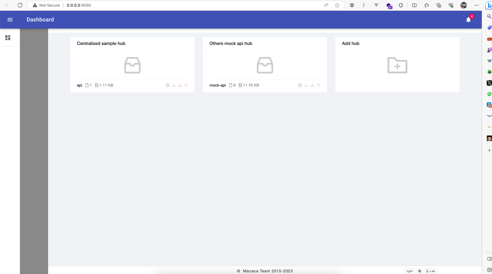
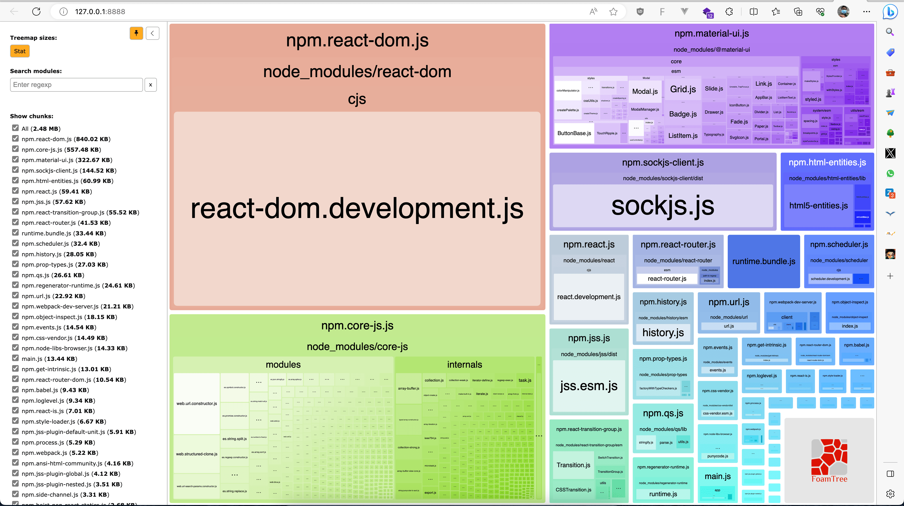

# DATAHUB

Personal Mock API Decentralized with React 16, Webpack 4, macaca-datahub, and MUI 4 (project for personal used)

---

## Screenshot

## License
[MIT](https://github.com/barayuda/datahub/blob/master/LICENSE)
